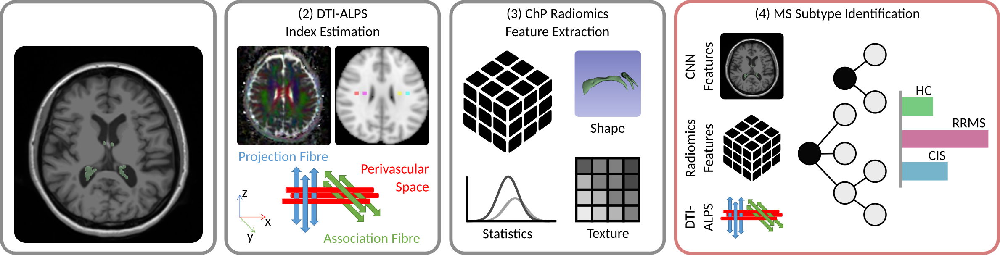
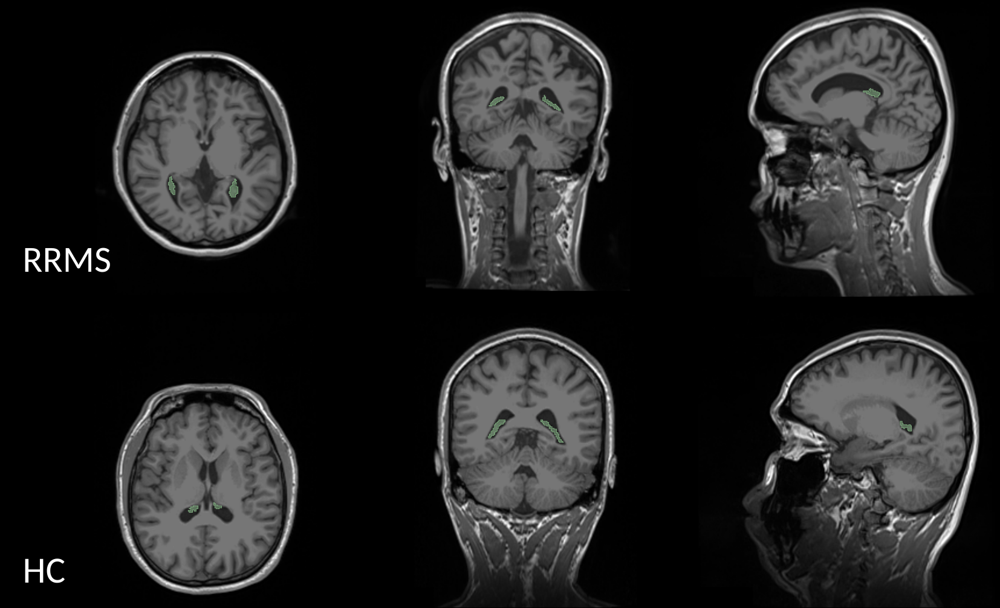
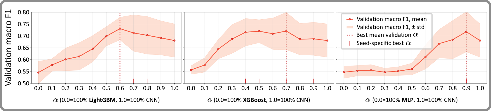

# DFG MS Plexus

This repository contains the code used to investigate Choroid Plexus (ChP) imaging characteristics as potential biomarkers of multiple sclerosis (MS).

The ChP produces cerebrospinal fluid (CSF) and forms the blood–CSF barrier. Previous studies have associated ChP enlargement with neuroinflammatory disease.
However, volume measurements alone may not capture clinically relevant differences in tissue shape and texture.

This project therefore combines:

* Choroid plexus segmentation using [nnU-Net](https://github.com/mic-dkfz/nnunet)
* Radiomic shape and texture features extracted with [PyRadiomics](https://pyradiomics.readthedocs.io/en/latest/)
* ALPS imaging metrics
* Convolutional neural network features derived from cropped MRI regions
* Late-fusion models for multiple-sclerosis classification



## Quick Start

1. Create and activate a Python environment of your choice with Python 3.10 or newer.
2. Install nnUNet from [here](https://github.com/MIC-DKFZ/nnUNet) if segmentation training or inference is needed.
3. Install the pinned project requirements via `pip install -r requirements.txt`
4. Install the local package via `pip install -e .`

## Usage

#### (Pre)processing

* You can normalize MRIs following FreeSurfer with

    ```
    python scripts/convert_freesurfer.py \
        --source_dir <...> \
        --output_dir <...> \
        --tmp_dir <...>
    ```
  
* You can extract cropped Regions of Interest (RoIs) around the ChPs with 

    ```
    python scripts/crop_mris.py \
        --source_img_dir <...> \
        --source_mask_dir <...> \
        --output_img_dir <...> \
        --output_mask_dir <...> \
        --target_size <...>
    ```

#### Splits

Create reusable and consistent patient-wise train/test splits with

```
python scripts/make_splits.py \
    --root <...> \
    --target <...> \
    --fts_file <...> \
    --train_file <...> \
    --test_file <...> \
    --test_split_size <...> \
    --random_seed <...> \
    --cv_seeds <...>
```

#### Training nnU-Net for ChP Segmentation

Please follow the process described [here](https://github.com/MIC-DKFZ/nnUNet) to prepare your dataset for training nnU-Net.

You can then use `bash scripts/nnunet_train_finetuned_folds_3d_fullres.sh` to train your own model using the configuration we used.

For evaluation, first predict the test set masks as described [here](https://github.com/MIC-DKFZ/nnUNet).

Then evaluate against the ground truth using `python scripts/eval_nnunet.py`



#### PyRadiomics Feature Extraction 

Extract PyRadiomics features from segmented ChPs with
```
python scripts/extract_radiomics_features.py \
    --img_dir <...> \
    --mask_dir <...> \
    --pyradiomics_conf <...> \
    --target_filename <...>
```

`notebooks/analyse___pyradiomics_features.ipynb` implements feature pre-processing and analysis examples.

#### Feature-Based MS Classifier Training

The `notebooks/train___*.ipynb` notebooks implement different classifiers to predict MS from PyRadiomics features and ALPS imaging metrics.

#### CNN MS Classifier Training

The notebook `notebooks/train___cnn_clf.ipynb` specifically trains a CNN classifier on extracted RoIs around the ChP.

#### Combining CNN and Feature-Based Classifiers with Late Fusion

`notebooks/eval___late_fusion___*.ipynb`

#### Results

| Model | Accuracy | Macro Precision | Macro Recall | Macro F1 |
|---|---:|---:|---:|---:|
| Balanced Bagging | 0.678 ± 0.023 | 0.486 ± 0.020 | 0.533 ± 0.018 | 0.506 ± 0.017 |
| Balanced Random Forest | 0.609 ± 0.032 | 0.493 ± 0.023 | 0.519 ± 0.022 | 0.501 ± 0.024 |
| CatBoost | 0.630 ± 0.036 | 0.527 ± 0.051 | 0.565 ± 0.056 | 0.536 ± 0.053 |
| LightGBM | 0.672 ± 0.028 | 0.552 ± 0.065 | 0.545 ± 0.031 | 0.545 ± 0.047 |
| XGBoost | 0.678 ± 0.008 | 0.547 ± 0.022 | _0.575 ± 0.010_ | _0.556 ± 0.018_ |
| Logistic Regression | 0.564 ± 0.031 | _0.568 ± 0.006_ | 0.532 ± 0.017 | 0.530 ± 0.015 |
| MLP | _0.684 ± 0.039_ | 0.560 ± 0.042 | 0.544 ± 0.023 | 0.547 ± 0.026 |
| TabNet | 0.654 ± 0.074 | 0.545 ± 0.077 | 0.542 ± 0.073 | 0.539 ± 0.072 |
| TabPFN | 0.561 ± 0.174 | 0.524 ± 0.020 | 0.536 ± 0.024 | 0.484 ± 0.068 |
||
| CNN (ChP RoI) | 0.800 ± 0.039 | 0.675 ± 0.050 | 0.646 ± 0.084 | 0.647 ± 0.061 |
||
| LightGBM + CNN (Late Fusion) | **0.866 ± 0.038** | **0.857 ± 0.093** | 0.726 ± 0.053 | 0.745 ± 0.058 |
| XGBoost + CNN (Late Fusion) | 0.848 ± 0.045 | 0.787 ± 0.057 | **0.741 ± 0.044** | **0.749 ± 0.051** |
| MLP + CNN (Late Fusion) | 0.830 ± 0.039 | 0.742 ± 0.101 | 0.712 ± 0.080 | 0.718 ± 0.085 |

Values are reported as mean ± standard deviation across five random seeds. Italic values indicate the best feature-based scores and bold values the best overall scores per metric.



Combining both model families with Late Fusion effectively fuses the feature-based models' sharper, more polarized probabilites with the CNN's softer distributions. This mechanism yields our strongest predictor with an F1-score of **0.741 ± 0.044** in the case of XGBoost + CNN, demonstrating an absolute increase of roughly **10%** over the CNN and **19%** over XGBoost alone.

## License

This project is licensed under the Apache License 2.0. See the [LICENSE](LICENSE) file for details.

## Acknowledgments

This work was funded by the Deutsche Forschungsgemeinschaft (DFG, German Research Foundation) – 515302522 / SPP 2177.
The funders had no role in method design, data selection and analysis, decision to publish, or preparation of the corresponding manuscript.

